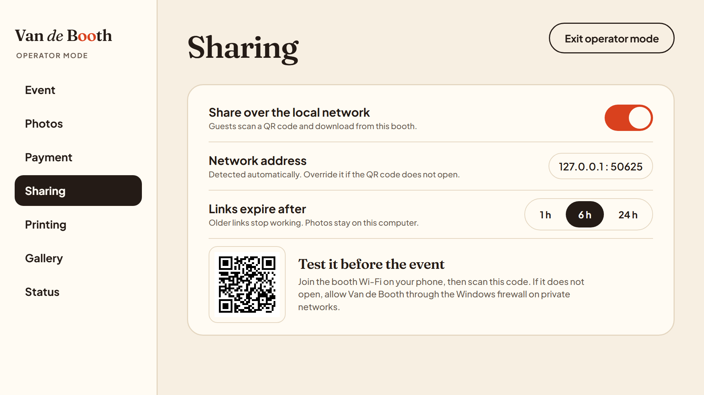
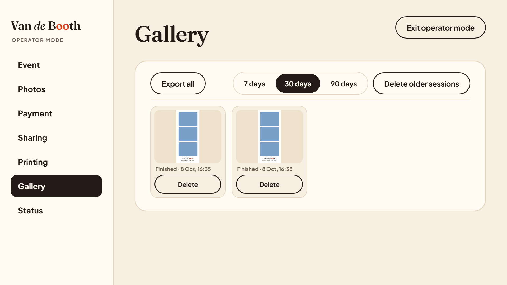
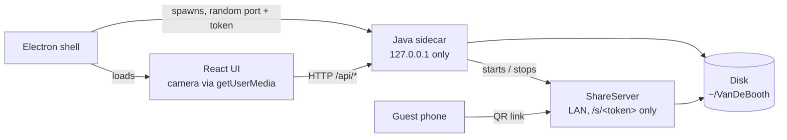

# Van de Booth


Van de Booth is an offline-first photobooth for events. Guests tap one button, pick a strip layout, pose for a 3-2-1 countdown, choose a look, then print the strip or scan a QR code to download it on their phone. It runs on one Windows PC with a webcam: a React touch UI inside Electron and a Java engine that composes, stores, prints and shares the strips. Photos never leave the booth PC.

## Features

- Six-screen guest flow: Attract, Layout, Capture, Review (retake single photos), Filter, Result. Idle screens return to the start on their own.
- 3 strip layouts: Vertical 4, Vertical 3, Horizontal 3.
- 4 filters: Original, Black & white, Vintage, Warm.
- Optional demo payment screen (no payment gateway, no real transactions).
- Printing on 4x6 paper, single strip or two-up, with a copy limit per guest.
- QR download over the local network: guests on the booth Wi-Fi open a download page served by the booth PC.
- Operator Mode behind a PIN: event name and date, photo timing, payment, sharing, printing, gallery, status.
- Gallery of past sessions with delete, ZIP export and cleanup of old sessions.
- Offline-first: no account, no cloud, no internet connection needed.

## Screenshots

| Layout | Capture | Filter |
|---|---|---|
|  |  |  |
| **Result** | **Operator: Sharing** | **Operator: Gallery** |
|  |  |  |

Screenshots use a synthetic test video feed. They are generated by the end-to-end tests at 1920x1080; all screens are in [docs/screenshots](docs/screenshots).

## Install (Windows 10/11, x64)

1. Download `VanDeBooth-Setup-2.0.0.exe` from [Releases](https://github.com/Umeem26/Photobooth-Studio/releases) and, if you like, compare it with `SHA256SUMS.txt` (`certutil -hashfile VanDeBooth-Setup-2.0.0.exe SHA256`).
2. The installer is not code-signed, so Windows SmartScreen shows "Windows protected your PC" (unrecognized app). Click **More info**, then **Run anyway**.
3. Choose the install folder. The app installs for the current user and adds Desktop and Start Menu shortcuts. Java is bundled; nothing else needs to be installed.
4. On first start Windows asks for firewall access for the QR download server. Allow it on **private networks**.

- Kiosk mode: add `--kiosk` to the shortcut target (fullscreen, no menu). F11 toggles fullscreen at any time.
- Photos and settings are stored in `~/VanDeBooth` and `%APPDATA%\VanDeBooth`. Uninstalling does **not** delete them.
- There is no auto-update. Install a newer version over the old one.

## Operator quick guide

1. On the start screen, press and hold the "Van de Booth" wordmark for 3 seconds.
2. First time: create a 4 to 8 digit PIN (typed twice). There is no default PIN. Five wrong PINs in a row lock the login for 30 seconds.
3. Before the event: set the event name and date (shown on the start screen and on every strip), pick the printer, and scan the test QR under **Sharing** with a phone on the booth Wi-Fi.
4. Guests' phones must join the same Wi-Fi or hotspot as the booth PC. If the QR does not open, enter the PC's address under **Sharing**. Links expire after 6 hours by default (1 or 24 hours selectable).
5. After the event: **Gallery** > **Export all** writes a ZIP of every session to `~/VanDeBooth/exports`.

Operator Mode closes after 5 minutes without activity. Forgot the PIN: close the app, delete `operator-pin.properties` in `%APPDATA%\VanDeBooth`, and create a new PIN.

## Architecture



The UI never touches the disk; the sidecar is the only process that writes files, and its API only listens on 127.0.0.1 with a per-launch token. The ShareServer is a separate LAN server that serves only expiring download pages. Details and a class diagram: [docs/ARCHITECTURE.md](docs/ARCHITECTURE.md).

## Design patterns

Counted from the current code: 4 GoF patterns plus 2 common non-GoF patterns.

| Pattern | Where |
|---|---|
| Facade | `PhotoboothService`, the single entry point for the HTTP server and Operator Mode |
| Strategy | `FilterStrategy` (4 filters), `ExportStrategy` (local file, print), `PaymentProvider` (demo) |
| Observer | `ConfigStore` listeners; `ShareService` reacts to sharing settings |
| Singleton | `CameraManager` (legacy webcam path, not used by the v2 flow) |
| Simple Factory | `TemplateFactory` builds strip templates from layout ids |
| Repository | `SessionRepository` stores sessions on disk |

## Tests

| Suite | Tests | Command |
|---|---|---|
| JUnit 5, Java engine (headless) | 105 in 19 classes | `./mvnw verify` |
| Vitest, UI state machine, strings, camera, API env | 27 | `npm test` |
| Node test, Electron sidecar launcher | 5 | `npm test` |
| Playwright, Chromium full flows with a real sidecar | 9 | `npm run e2e` |
| Playwright, Electron dev shell and packaged app | 2 | `npm run e2e`, `npm run e2e:packaged` |

The camera in browser tests is Chromium's fake device fed with `ui/e2e/fixtures/test-feed.mjpeg`. No test needs a webcam, printer or GUI session for Java. Code size (non-blank lines): Java engine 4,035 (51 files) plus 1,969 test lines; UI 3,036 plus 316 test lines; Electron shell 241; end-to-end tests 664.

## Development

Requirements: JDK 17+ (21 for packaging), Node.js 20+. Maven is not needed (wrapper included).

```bash
npm install
npm run dev                 # Vite + Electron; Electron starts the Java sidecar
npm run build               # target/vandebooth.jar and ui/dist
npm test                    # Vitest + Node tests
./mvnw verify               # JUnit + fat JAR (Windows: mvnw.cmd verify)
npm run e2e                 # Playwright, saves screenshots to docs/screenshots
npm run package             # Windows installer in desktop/release (add -- --dir for an unpacked app)
npm run e2e:packaged        # smoke test against the packaged app
```

Settings start from `src/main/resources/config.properties`, then `./config.properties`, the Operator Mode file in the user config folder, and finally `-Dvandebooth.<key>=...`. The sidecar can run alone: `VANDEBOOTH_TOKEN=<16+ chars> java -jar target/vandebooth.jar --server`.

## Project history

Started as a 3-person OOP course project (Umem, Ibnu, Ihsan). Version 2 is a product rebuild: new UI, operator mode, sharing, printing. The original Java Swing app is kept at the tag `legacy-swing-ui` and release v1.0.0.

## License

MIT, see [LICENSE](LICENSE).

## Credits

- Fraunces and Plus Jakarta Sans fonts: SIL Open Font License 1.1 (license files in `src/main/resources/fonts`).
- `shutter.wav`: source and license unknown and not used by the current code; it must be replaced with a clearly licensed sound before any commercial use (see [ASSETS.md](ASSETS.md)).
- The test video feed is a synthetic illustration, not real people.
