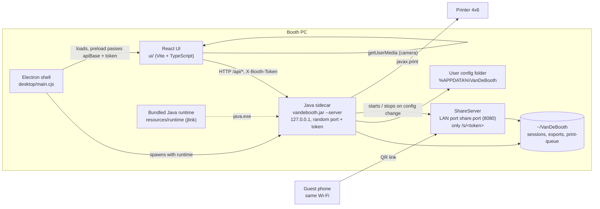
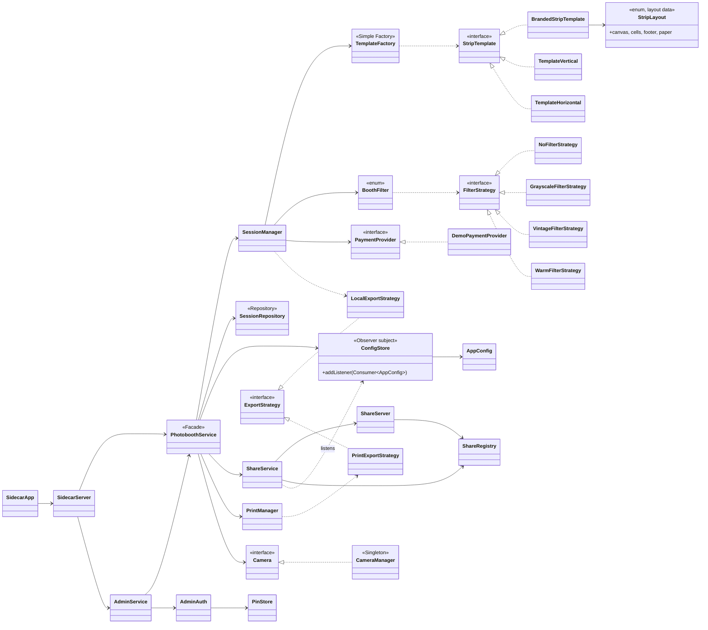

# Van de Booth architecture

Version 2.1.0. Everything runs on one Windows PC; nothing is uploaded to the internet.

## Components

- **Electron** (`desktop/`): single instance, starts the sidecar on a random port with a random token, waits for `/health`, loads the built UI, allows the camera only for the app origin, and stops the sidecar on quit. `--kiosk` opens fullscreen without a menu; F11 toggles fullscreen. In the installed app the sidecar runs on the bundled jlink runtime; in development it uses the system Java.
- **UI** (`ui/`): React 18, reducer-based state machine (`ui/src/state/machine.ts`), design tokens in `ui/src/styles/tokens.css`, all text in `ui/src/strings.ts`. The camera is read in the browser (`getUserMedia`); each photo is sent to the sidecar as a JPEG.
- **Sidecar** (`src/main/java`): `com.sun.net.httpserver` bound to 127.0.0.1. Every request needs the `X-Booth-Token` header. Routes: `/health`, `/api/config`, `/api/layouts` (id, name, photos, paper, `canvas`, `cells`, `footer`), `/api/filters`, `/api/printers`, `/api/sessions/*` (frames, compose, export, payment, share, print), `/api/admin/*` (login, PIN, config, sessions, export-all, purge, status, print and share tests).
- **ShareServer** (`share/`): a separate HTTP server on the LAN that serves only `/s/<token>` download pages with expiring links and rate limiting. The main API never leaves 127.0.0.1.

## Guest flow

Attract, Layout, (Pay, only when demo payment is on), Capture, Review, Filter, Result. Layout, Pay, Review and Filter return to Attract after 90 seconds without input; Result returns after 45 seconds. Capture runs its own countdown. Operator Mode opens by holding the wordmark on Attract for 3 seconds.

## Classes (sidecar)

## Design patterns in the code

| Pattern | Where | Notes |
|---|---|---|
| Facade (GoF) | `service.PhotoboothService` | Single entry point for `SidecarServer` and `AdminService`. |
| Strategy (GoF) | `filter.FilterStrategy` (4), `export.ExportStrategy` (2), `payment.PaymentProvider` (1) | Filters are chosen through the `BoothFilter` enum; export is local file or print. |
| Observer (GoF) | `config.ConfigStore.addListener` | `ShareService` restarts or stops the LAN server when Operator Mode changes sharing settings. |
| Singleton (GoF) | `hardware.CameraManager` | Holder idiom. Legacy webcam path; in v2 the camera is read by the UI, so the sidecar does not use it. |
| Simple Factory | `factory.TemplateFactory` | Builds `StripTemplate` objects from layout ids. |
| Repository | `repository.SessionRepository` | Session folders on disk (`sessions/<timestamp>/`). |

## Storage

- `~/VanDeBooth/sessions/<timestamp>/`: frames, `strip.png`, session metadata.
- `~/VanDeBooth/exports/`: "Save photos" copies and ZIP exports from Operator Mode.
- `~/VanDeBooth/print-queue/`: print pages when `print.mode=file`.
- User config folder (`%APPDATA%\VanDeBooth` on Windows, `~/.config/vandebooth` elsewhere): Operator Mode settings and the PIN hash (PBKDF2 with salt).

Uninstalling the app does not remove any of these folders.

## Packaging

`npm run package` builds the JAR and the UI, creates a reduced Java runtime with `jlink` (modules from `jdeps` plus `java.desktop`, `java.logging`, `java.naming`, `jdk.httpserver`, `java.prefs`, `java.sql`), and runs electron-builder (NSIS, x64, per-user). The resources folder contains `ui/`, `runtime/` and `vandebooth.jar`. Output and `SHA256SUMS.txt` go to `desktop/release/`.
